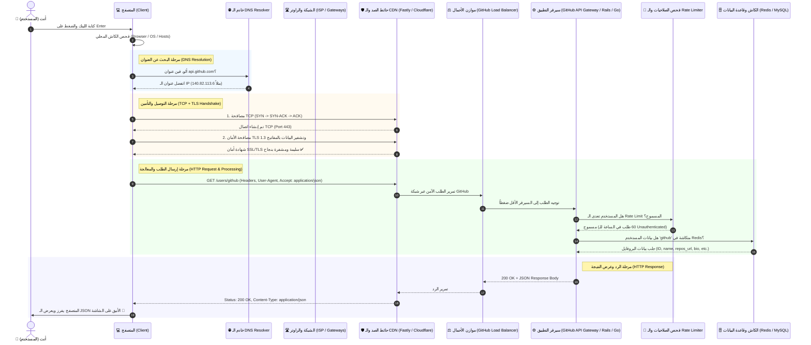

# 🚀 رحلة الـ Request: إيه اللي بيحصل لما تطلب رابط في المتصفح؟

> **الرابط المستهدف:** `https://api.github.com/users/github`  
> **نوع الطلب:** HTTPS GET Request لجلب بيانات مستخدم بصيغة JSON.

---

## 🗺️ 1. المخطط التوضيحي (Architecture & Flow Diagram)

تقدر تشوف الرسمة مباشرة هنا بـ Mermaid، وتقدر تفتح كود الـ XML المرفق أسفل الملف على [Draw.io](https://app.diagrams.net/) أو تستورده بنقرة واحدة!



---

## ☕ 2. الشرح المبسط

تخيل معايا إنك عايز تبعت جواب لصاحبك اللي اسمه "أحمد" في إنجلترا، بس أنت معكش غير اسمه ومعكش عنوان بيته بالظبط. إيه اللي بيحصل خطوة بخطوة أول ما تكتب `https://api.github.com/users/github` وتدوس **Enter**؟

### 1️⃣ "يا متصفح.. مين ده وعنوانه إيه؟" (DNS Lookup)
* **المتصفح (Browser):** أول ما تدوس Enter، المتصفح مش بيفهم كلام حروف زي `api.github.com`، الكمبيوتر بيفهم بس أرقام **IP Address** (زي أرقام التليفونات).
* المتصفح بيبص الأول في جيبه: "هل سألت على العنوان ده من شوية؟" (Browser Cache & OS Cache).
* لو ملقاهوش، بيروح يسأل **DNS Resolver** (دليل التليفونات الأكبر على الإنترنت): *"يا عم الدليل، هو سيرفر api.github.com ساكن فين؟"*
* الـ DNS يرد: *"ساكن في العنوان `140.82.113.6`"*.

### 2️⃣ "أهلاً يا سيرفر.. يلا نتكلم بس في السر!" (TCP + TLS Handshake)
* المتصفح محتاج يفتح ماسورة اتصال بينه وبين السيرفر.
* **TCP Handshake:** بيسلّموا على بعض بـ 3 خطوات (SYN -> SYN-ACK -> ACK) كأنه بيقول له: "سامعني؟" - "آه سامعك، سامعني أنت؟" - "تمام سامعك، يلا ندردش!".
* **HTTPS / TLS:** علشان الرابط بيبدأ بـ `https` والبيانات ما حدش في النص يقدر يتجسس عليها أو يسرقها، المتصفح والسيرفر بيتبادلوا شهادات أمان ومفاتيح تشفير سرية جداً.

### 3️⃣ الطلب سافر (The HTTP GET Request)
* المتصفح يجهز الظرف المكتوب فيه:
  ```http
  GET /users/github HTTP/2
  Host: api.github.com
  Accept: application/json
  User-Agent: Mozilla/5.0 ...
  ```
* ويبعته عبر كابلات النت والراوتر والـ ISP لحد ما يوصل لمراكز بيانات GitHub.

### 4️⃣ أول محطة استقبال: حارس البوابة (CDN & Reverse Proxy)
* الطلب بيخبط الأول على سيرفرات سريعة قريبة منك اسمها **CDN / Edge** (زي Fastly أو Cloudflare). وظيفتها تحمي سيرفرات GitHub وتسرّع الرد.
* بتمرر الطلب للـ **Load Balancer** (موزع الأحمال): وده زي موظف الاستقبال اللي بيشوف مين أحسن وأسرع سيرفر فاضي حالياً في الداتا سنتر ويبعتله الطلب.

### 5️⃣ قلب السيرفر والـ Backend (Business Logic)
* الطلب بيوصل للـ **API Gateway / Backend Service**:
  1. **Rate Limiting (التحقق من عدد الطلبات):** السيرفر يشوف الـ IP بتاعك: "هل ده أول طلب ليه، ولا بيبعت 1000 طلب في الدقيقة وبيحاول يوقّع الموقع؟". لو تمام بيعديه.
  2. **الكاش وقاعدة البيانات (Cache & Database):** السيرفر يروح يشوف هل بروفايل `users/github` متخزن في الكاش السريع (Redis)؟ لو موجود بيجيبه فوراً، لو لأ يقرأه من الـ Database الأساسية.
  3. السيرفر يحط البيانات في قالب **JSON**.

### 6️⃣ الرد راجع في السكة (HTTP Response)
* السيرفر يبعت الرد وفيه:
  * كود الحالة: `200 OK` (يعني تمام وزي الفل، طلبك نجح).
  * نوع المحتوى: `Content-Type: application/json`.
  * جسم الرسالة (Body):
    ```json
    {
      "login": "github",
      "id": 9919,
      "name": "GitHub",
      "company": null,
      "blog": "https://github.com/about",
      "location": "San Francisco, CA",
      "public_repos": 505
    }
    ```

### 7️⃣ المتصفح يستلم ويعرض (Client Rendering)
* المتصفح يستقبل حزم البيانات، يفك التشفير، يلاقي الـ JSON ده جاهز ومكتوب صح.
* يعرضهولك على الشاشة بشكل منظم أو الكود يستعمله في الـ Frontend لو كان طلب من كود JavaScript!

---

## 🎨 3. ملف الرسمة الجاهز لبرنامج Draw.io (XML Source)

> **طريقة الاستخدام:**
> 1. افتح موقع **[app.diagrams.net](https://app.diagrams.net/)**.
> 2. اضغط على **File** > **Import from** > **Text/XML** أو اختر **Open Existing Diagram**.
> 3. الصق كود الـ XML التالي واحفظ الرسمة أو عدل عليها براحتك:

```xml
<mxfile host="app.diagrams.net" modified="2026-09-19T17:00:00.000Z" agent="Antigravity" version="21.0.0" type="device">
  <diagram id="request-journey" name="Request Journey - api.github.com">
    <mxGraphModel dx="1422" dy="794" grid="1" gridSize="10" guides="1" tooltips="1" connect="1" arrows="1" fold="1" page="1" pageScale="1" pageWidth="1169" pageHeight="827" background="#0f172a" math="0" shadow="0">
      <root>
        <mxCell id="0" />
        <mxCell id="1" parent="0" />
        
        <!-- Header -->
        <mxCell id="title" value="Journey of a Request: https://api.github.com/users/github" style="text;html=1;strokeColor=none;fillColor=none;align=center;verticalAlign=middle;whiteSpace=wrap;rounded=0;fontSize=22;fontStyle=1;fontColor=#38bdf8;" vertex="1" parent="1">
          <mxGeometry x="250" y="30" width="670" height="40" as="geometry" />
        </mxCell>
        
        <!-- Nodes -->
        <!-- 1. Client -->
        <mxCell id="client" value="&lt;b&gt;1. Client (Browser)&lt;/b&gt;&lt;br&gt;كتبت الرابط وضغطت Enter&lt;br&gt;فحص كاش المتصفح والنظام" style="rounded=1;whiteSpace=wrap;html=1;fillColor=#1e293b;strokeColor=#38bdf8;strokeWidth=2;fontColor=#f8fafc;arcSize=14;" vertex="1" parent="1">
          <mxGeometry x="40" y="140" width="180" height="90" as="geometry" />
        </mxCell>

        <!-- 2. DNS -->
        <mxCell id="dns" value="&lt;b&gt;2. DNS Resolver&lt;/b&gt;&lt;br&gt;سؤال عن IP لـ api.github.com&lt;br&gt;الرد بـ IP: 140.82.113.6" style="rounded=1;whiteSpace=wrap;html=1;fillColor=#1e293b;strokeColor=#a855f7;strokeWidth=2;fontColor=#f8fafc;arcSize=14;" vertex="1" parent="1">
          <mxGeometry x="290" y="140" width="180" height="90" as="geometry" />
        </mxCell>

        <!-- 3. TCP/TLS Handshake -->
        <mxCell id="handshake" value="&lt;b&gt;3. TCP &amp;amp; TLS Handshake&lt;/b&gt;&lt;br&gt;اتصال آمن Port 443&lt;br&gt;تشفير المفاتيح والشهادة" style="rounded=1;whiteSpace=wrap;html=1;fillColor=#1e293b;strokeColor=#10b981;strokeWidth=2;fontColor=#f8fafc;arcSize=14;" vertex="1" parent="1">
          <mxGeometry x="540" y="140" width="180" height="90" as="geometry" />
        </mxCell>

        <!-- 4. CDN / Edge & WAF -->
        <mxCell id="cdn" value="&lt;b&gt;4. CDN &amp;amp; Edge Proxy&lt;/b&gt;&lt;br&gt;حماية وفحص الـ DDoS&lt;br&gt;Fastly / Cloudflare Edge" style="rounded=1;whiteSpace=wrap;html=1;fillColor=#1e293b;strokeColor=#f59e0b;strokeWidth=2;fontColor=#f8fafc;arcSize=14;" vertex="1" parent="1">
          <mxGeometry x="790" y="140" width="180" height="90" as="geometry" />
        </mxCell>

        <!-- 5. Load Balancer -->
        <mxCell id="lb" value="&lt;b&gt;5. Load Balancer (LB)&lt;/b&gt;&lt;br&gt;توزيع الأحمال لمراكز بيانات&lt;br&gt;GitHub الداخلية" style="rounded=1;whiteSpace=wrap;html=1;fillColor=#1e293b;strokeColor=#ec4899;strokeWidth=2;fontColor=#f8fafc;arcSize=14;" vertex="1" parent="1">
          <mxGeometry x="790" y="320" width="180" height="90" as="geometry" />
        </mxCell>

        <!-- 6. API Gateway & Middleware -->
        <mxCell id="gateway" value="&lt;b&gt;6. API Service / Guard&lt;/b&gt;&lt;br&gt;فحص Rate Limiting&lt;br&gt;والتأكد من Headers و Routing" style="rounded=1;whiteSpace=wrap;html=1;fillColor=#1e293b;strokeColor=#ef4444;strokeWidth=2;fontColor=#f8fafc;arcSize=14;" vertex="1" parent="1">
          <mxGeometry x="540" y="320" width="180" height="90" as="geometry" />
        </mxCell>

        <!-- 7. Cache & DB -->
        <mxCell id="db" value="&lt;b&gt;7. Data Store (Redis / DB)&lt;/b&gt;&lt;br&gt;جلب البروفايل لمستخدم: github&lt;br&gt;تجهيز استجابة الـ JSON" style="rounded=1;whiteSpace=wrap;html=1;fillColor=#1e293b;strokeColor=#6366f1;strokeWidth=2;fontColor=#f8fafc;arcSize=14;" vertex="1" parent="1">
          <mxGeometry x="290" y="320" width="180" height="90" as="geometry" />
        </mxCell>

        <!-- 8. Browser Response -->
        <mxCell id="resp" value="&lt;b&gt;8. المتصفح يعرض النتيجة&lt;/b&gt;&lt;br&gt;كود 200 OK + JSON Data&lt;br&gt;عرض بيانات البروفايل للمستخدم" style="rounded=1;whiteSpace=wrap;html=1;fillColor=#1e293b;strokeColor=#22c55e;strokeWidth=2;fontColor=#f8fafc;arcSize=14;" vertex="1" parent="1">
          <mxGeometry x="40" y="320" width="180" height="90" as="geometry" />
        </mxCell>

        <!-- Connectors -->
        <mxCell id="e1" style="edgeStyle=orthogonalEdgeStyle;rounded=0;orthogonalLoop=1;jettySize=auto;html=1;strokeColor=#38bdf8;strokeWidth=2;fontColor=#f8fafc;" edge="1" parent="1" source="client" target="dns">
          <mxGeometry relative="1" as="geometry" />
        </mxCell>
        <mxCell id="e1-lbl" value="طلب عنوان IP" style="edgeLabel;html=1;align=center;verticalAlign=middle;resizable=0;points=[];fontColor=#94a3b8;fontSize=11;" vertex="1" connectable="0" parent="e1">
          <mxGeometry x="-0.1" relative="1" as="geometry"><mxPoint as="offset" /></mxGeometry>
        </mxCell>

        <mxCell id="e2" style="edgeStyle=orthogonalEdgeStyle;rounded=0;orthogonalLoop=1;jettySize=auto;html=1;strokeColor=#a855f7;strokeWidth=2;fontColor=#f8fafc;" edge="1" parent="1" source="dns" target="handshake">
          <mxGeometry relative="1" as="geometry" />
        </mxCell>
        <mxCell id="e2-lbl" value="عنوان السيرفر" style="edgeLabel;html=1;align=center;verticalAlign=middle;resizable=0;points=[];fontColor=#94a3b8;fontSize=11;" vertex="1" connectable="0" parent="e2">
          <mxGeometry x="-0.1" relative="1" as="geometry"><mxPoint as="offset" /></mxGeometry>
        </mxCell>

        <mxCell id="e3" style="edgeStyle=orthogonalEdgeStyle;rounded=0;orthogonalLoop=1;jettySize=auto;html=1;strokeColor=#10b981;strokeWidth=2;fontColor=#f8fafc;" edge="1" parent="1" source="handshake" target="cdn">
          <mxGeometry relative="1" as="geometry" />
        </mxCell>
        <mxCell id="e3-lbl" value="تشفير HTTPS" style="edgeLabel;html=1;align=center;verticalAlign=middle;resizable=0;points=[];fontColor=#94a3b8;fontSize=11;" vertex="1" connectable="0" parent="e3">
          <mxGeometry x="-0.1" relative="1" as="geometry"><mxPoint as="offset" /></mxGeometry>
        </mxCell>

        <mxCell id="e4" style="edgeStyle=orthogonalEdgeStyle;rounded=0;orthogonalLoop=1;jettySize=auto;html=1;strokeColor=#f59e0b;strokeWidth=2;fontColor=#f8fafc;" edge="1" parent="1" source="cdn" target="lb">
          <mxGeometry relative="1" as="geometry" />
        </mxCell>
        <mxCell id="e4-lbl" value="GET /users/github" style="edgeLabel;html=1;align=center;verticalAlign=middle;resizable=0;points=[];fontColor=#94a3b8;fontSize=11;" vertex="1" connectable="0" parent="e4">
          <mxGeometry x="-0.1" relative="1" as="geometry"><mxPoint as="offset" /></mxGeometry>
        </mxCell>

        <mxCell id="e5" style="edgeStyle=orthogonalEdgeStyle;rounded=0;orthogonalLoop=1;jettySize=auto;html=1;strokeColor=#ec4899;strokeWidth=2;fontColor=#f8fafc;" edge="1" parent="1" source="lb" target="gateway">
          <mxGeometry relative="1" as="geometry" />
        </mxCell>
        <mxCell id="e5-lbl" value="توجيه السيرفر الفاضي" style="edgeLabel;html=1;align=center;verticalAlign=middle;resizable=0;points=[];fontColor=#94a3b8;fontSize=11;" vertex="1" connectable="0" parent="e5">
          <mxGeometry x="-0.1" relative="1" as="geometry"><mxPoint as="offset" /></mxGeometry>
        </mxCell>

        <mxCell id="e6" style="edgeStyle=orthogonalEdgeStyle;rounded=0;orthogonalLoop=1;jettySize=auto;html=1;strokeColor=#ef4444;strokeWidth=2;fontColor=#f8fafc;" edge="1" parent="1" source="gateway" target="db">
          <mxGeometry relative="1" as="geometry" />
        </mxCell>
        <mxCell id="e6-lbl" value="استعلام الكاش/DB" style="edgeLabel;html=1;align=center;verticalAlign=middle;resizable=0;points=[];fontColor=#94a3b8;fontSize=11;" vertex="1" connectable="0" parent="e6">
          <mxGeometry x="-0.1" relative="1" as="geometry"><mxPoint as="offset" /></mxGeometry>
        </mxCell>

        <mxCell id="e7" style="edgeStyle=orthogonalEdgeStyle;rounded=0;orthogonalLoop=1;jettySize=auto;html=1;strokeColor=#6366f1;strokeWidth=2;fontColor=#f8fafc;" edge="1" parent="1" source="db" target="resp">
          <mxGeometry relative="1" as="geometry" />
        </mxCell>
        <mxCell id="e7-lbl" value="200 OK + JSON Body" style="edgeLabel;html=1;align=center;verticalAlign=middle;resizable=0;points=[];fontColor=#94a3b8;fontSize=11;" vertex="1" connectable="0" parent="e7">
          <mxGeometry x="-0.1" relative="1" as="geometry"><mxPoint as="offset" /></mxGeometry>
        </mxCell>

      </root>
    </mxGraphModel>
  </diagram>
</mxfile>
```

---

## 🎯 خلاصة مهمة للمطورين (Node.js & NestJS)
لما تبني نظام فواتير أو متجر إلكتروني مستقبلاً:
- المحطات دي هي نفس فكرة الـ **Guards, Interceptors, Pipes, Middlewares** في NestJS.
- كل طلب قبل ما يلمس قاعدة البيانات بيمر بحراس (Authentication, Rate-limiting, Validation).
- الرسمة دي بتوضح الرؤية الشاملة من أول كابل النت لحد الـ Database Record!
