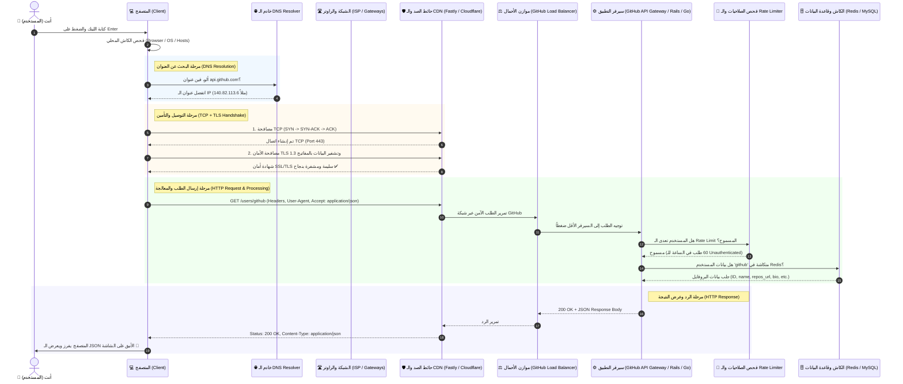

# 🚀 رحلة الـ Request: إيه اللي بيحصل لما تطلب رابط في المتصفح؟

> **الرابط المستهدف:** `https://api.github.com/users/github`  
> **أداة الرسم المقترحة:** [Excalidraw](https://excalidraw.com) 🎨 & [Draw.io](https://app.diagrams.net/)

---

## 🎨 1. كيفية فتح واستخدام الرسمة على Excalidraw

تم إنشاء ملف بصيغة Excalidraw الأصلية: **[`request_journey.excalidraw`](file:///c:/Users/ahmed/.gemini/antigravity-ide/scratch/beautiful_website/request_journey.excalidraw)**.

### طريقة فتح الملف على موقع Excalidraw:
1. ادخل على الموقع: **[https://excalidraw.com](https://excalidraw.com)**
2. اضغط على أيقونة القائمة (أعلى اليسار أو علامة المجلد **Open / فتح**).
3. اختر ملف **`request_journey.excalidraw`** من جهازك (أو اسحب الملف وأفلته مباشرة داخل صفحة المتصفح - **Drag & Drop**).
4. ستظهر لك الرسمة بأسلوب اليدوي الرائع (Hand-drawn style) بألوان منسقة لجميع المحطات مع إمكانية تحريكها وتعديلها بسهولة.

---

## 🗺️ 2. المخطط التسلسلي التفاعلي (Sequence Flow Diagram)



---

## ☕ 3. الشرح المبسط (كأننا بنشرب شاي وبنحكي لواحد صاحبنا)

تخيل معايا إنك عايز تبعت جواب لصاحبك اللي اسمه "أحمد" في إنجلترا، بس أنت معكش غير اسمه ومعكش عنوان بيته بالظبط. إيه اللي بيحصل خطوة بخطوة أول ما تكتب `https://api.github.com/users/github` وتدوس **Enter**؟

### 1️⃣ "يا متصفح.. مين ده وعنوانه إيه؟" (DNS Lookup)
* **المتصفح (Browser):** أول ما تدوس Enter، المتصفح مش بيفهم كلام حروف زي `api.github.com`، الكمبيوتر بيفهم بس أرقام **IP Address** (زي أرقام التليفونات).
* المتصفح بيبص الأول في جيبه: "هل سألت على العنوان ده من شوية؟" (Browser Cache & OS Cache).
* لو ملقاهوش، بيروح يسأل **DNS Resolver** (دليل التليفونات الأكبر على الإنترنت): *"يا عم الدليل، هو سيرفر api.github.com ساكن فين؟"*
* الـ DNS يرد: *"ساكن في العنوان `140.82.113.6`"*.

### 2️⃣ "أهلاً يا سيرفر.. يلا نتكلم بس في السر!" (TCP + TLS Handshake)
* المتصفح محتاج يفتح ماسورة اتصال بينه وبين السيرفر.
* **TCP Handshake:** بيسلّموا على بعض بـ 3 خطوات (SYN -> SYN-ACK -> ACK) كأنه بيقول له: "سامعني؟" - "آه سامعك، سامعني أنت؟" - "تمام سامعك، يلا ندردش!".
* **HTTPS / TLS:** علشان الرابط بيبدأ بـ `https` والبيانات ما حدش في النص يقدر يتجسس عليها أو يسرقها، المتصفح والسيرفر بيتبادلوا شهادات أمان ومفاتيح تشفير سرية جداً.

### 3️⃣ الطلب سافر (The HTTP GET Request)
* المتصفح يجهز الظرف المكتوب فيه:
  ```http
  GET /users/github HTTP/2
  Host: api.github.com
  Accept: application/json
  User-Agent: Mozilla/5.0 ...
  ```
* ويبعته عبر كابلات النت والراوتر والـ ISP لحد ما يوصل لمراكز بيانات GitHub.

### 4️⃣ أول محطة استقبال: حارس البوابة (CDN & Reverse Proxy)
* الطلب بيخبط الأول على سيرفرات سريعة قريبة منك اسمها **CDN / Edge** (زي Fastly أو Cloudflare). وظيفتها تحمي سيرفرات GitHub وتسرّع الرد.
* بتمرر الطلب للـ **Load Balancer** (موزع الأحمال): وده زي موظف الاستقبال اللي بيشوف مين أحسن وأسرع سيرفر فاضي حالياً في الداتا سنتر ويبعتله الطلب.

### 5️⃣ قلب السيرفر والـ Backend (Business Logic)
* الطلب بيوصل للـ **API Gateway / Backend Service**:
  1. **Rate Limiting (التحقق من عدد الطلبات):** السيرفر يشوف الـ IP بتاعك: "هل ده أول طلب ليه، ولا بيبعت 1000 طلب في الدقيقة وبيحاول يوقّع الموقع؟". لو تمام بيعديه.
  2. **الكاش وقاعدة البيانات (Cache & Database):** السيرفر يروح يشوف هل بروفايل `users/github` متخزن في الكاش السريع (Redis)؟ لو موجود بيجيبه فوراً، لو لأ يقرأه من الـ Database الأساسية.
  3. السيرفر يحط البيانات في قالب **JSON**.

### 6️⃣ الرد راجع في السكة (HTTP Response)
* السيرفر يبعت الرد وفيه:
  * كود الحالة: `200 OK` (يعني تمام وزي الفل، طلبك نجح).
  * نوع المحتوى: `Content-Type: application/json`.
  * جسم الرسالة (Body):
    ```json
    {
      "login": "github",
      "id": 9919,
      "name": "GitHub",
      "company": null,
      "blog": "https://github.com/about",
      "location": "San Francisco, CA",
      "public_repos": 505
    }
    ```

### 7️⃣ المتصفح يستلم ويعرض (Client Rendering)
* المتصفح يستقبل حزم البيانات، يفك التشفير، يلاقي الـ JSON ده جاهز ومكتوب صح.
* يعرضهولك على الشاشة بشكل منظم أو الكود يستعمله في الـ Frontend لو كان طلب من كود JavaScript!

---

## 🎯 خلاصة مهمة للمطورين (Node.js & NestJS)
لما تبني نظام فواتير أو متجر إلكتروني مستقبلاً:
- المحطات دي هي نفس فكرة الـ **Guards, Interceptors, Pipes, Middlewares** في NestJS.
- كل طلب قبل ما يلمس قاعدة البيانات بيمر بحراس (Authentication, Rate-limiting, Validation).
- الرسمة دي بتوضح الرؤية الشاملة من أول كابل النت لحد الـ Database Record!
